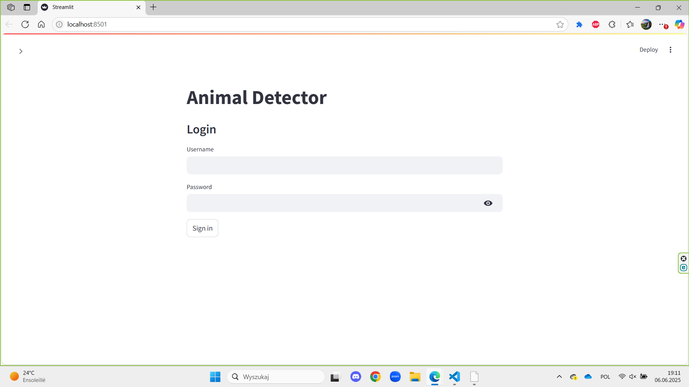
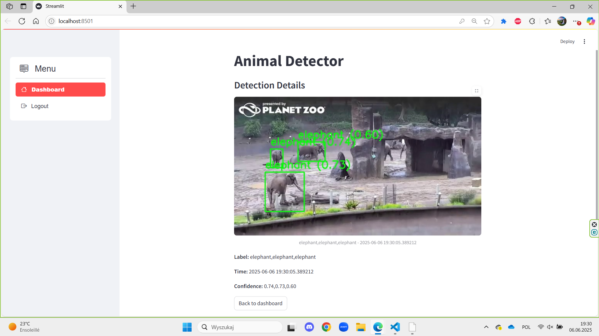
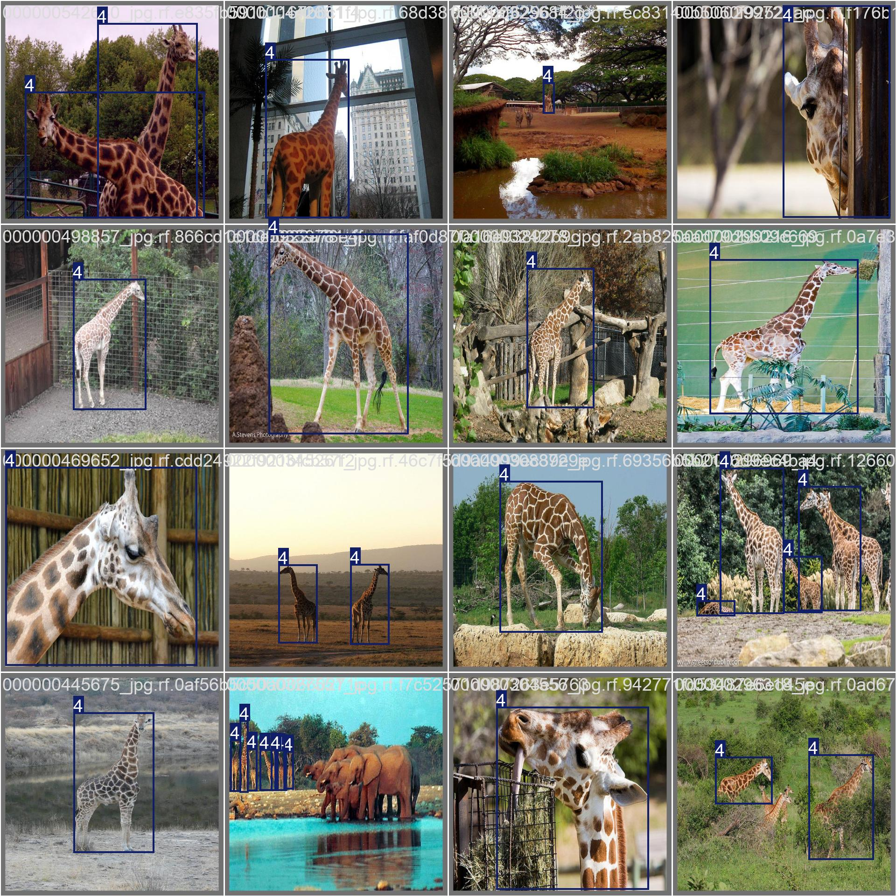
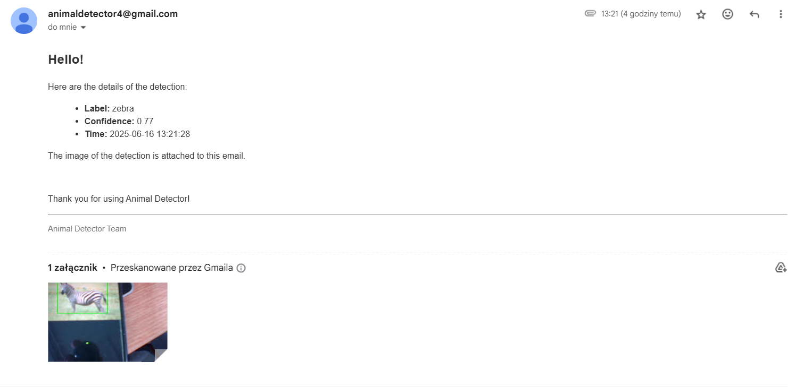
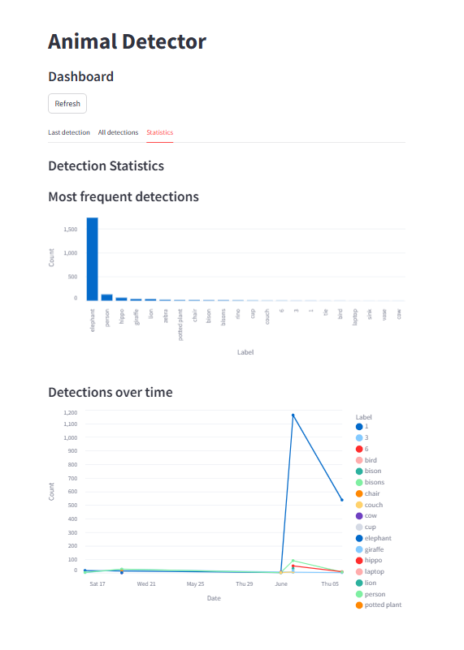
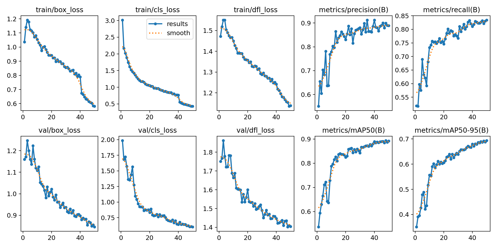

# NatureAlertCamera24

NatureAlertCamera24 is a camera trap project that analyzes live camera feeds and detects objects using the YOLO model. When an animal is detected, the system saves the frame and detection data to a database, making it easy to browse and filter event histories. The application connects to an API, provides a preview of the results in the Streamlit panel, and optionally sends email notifications with detection details. In practice, it works like a digital camera trap. The camera observes the area, and the model performs detections. The entire data flow is saved to a database and then displayed on a website, where you can quickly see what, when, and with what probability was detected.


NatureAlertCamera24 to projekt fotopułapki, który analizuje obraz z kamery na żywo i wykrywa obiekty za pomocą modelu YOLO. Po wykryciu zwierzęcia system zapisuje klatkę i dane detekcji w bazie danych, ułatwiając przeglądanie i filtrowanie historii zdarzeń. Aplikacja łączy się z API, udostępnia podgląd wyników w panelu Streamlit i opcjonalnie wysyła powiadomienia e-mail ze szczegółami detekcji. W praktyce działa jak cyfrowa fotopułapka. Kamera obserwuje obszar, model wykonuje detekcje. Cały przepływ danych jest zapisywany w bazie danych, a następnie wyświetlany na stronie, gdzie można szybko sprawdzić, co, kiedy i z jakim prawdopodobieństwem zostało wykryte.

## Technologie

- Python 3.11
- FastAPI, Uvicorn
- SQLAlchemy
- Streamlit
- Ultralytics, YOLO
- OpenCV
- PostgreSQL, SQLite
- SMTP, gmail

## Struktura projektu

```
src/nature_alert_camera24/
   api/
   client/
   services/
   ui/
   config.py
   db.py
   models.py
   security.py
scripts/
requirements.txt
.env
datasets/
  
```

## Konfiguracja

1. Zainstaluj zależności:

```bash
pip install -r requirements.txt
```

2. Skopiuj plik `.env.example` do `.env` i uzupełnij wartości.

Minimalna konfiguracja lokalna:

- `NATURE_ALERT_CAMERA24_DATABASE_URL=sqlite:///./nature_alert_camera24.db`
- `NATURE_ALERT_CAMERA24_UPLOAD_URL=http://127.0.0.1:8000/upload/`

Opcjonalnie dla e-maili:

- `NATURE_ALERT_CAMERA24_EMAIL_ADDRESS`
- `NATURE_ALERT_CAMERA24_EMAIL_PASSWORD`
- `NATURE_ALERT_CAMERA24_DEFAULT_RECIPIENT`

## Uruchomienie

1. API:

```bash
uvicorn scripts.server:app --host 0.0.0.0 --port 8000
```

2. Panel Streamlit:

```bash
streamlit run scripts/app_s.py
```

3. statyczne obrazy:

```bash
python scripts/client.py
```

4. YOLO i detekcja live:

```bash
python scripts/client_with_model.py
```

## Działanie

- Endpoint upload przyjmuje zdjęcie, etykietę i pewnosc detekcji.
- Detekcja jest zapisywana w bazie.
- Jeżeli skonfigurowano protokół SMTP, aplikacja wysyła e-mail z podsumowaniem i załącznikiem.
- W Streamlit mozna:
   - zarejestrować użytkownika,
   - przeglądać ostatnie i historyczne detekcje,
   - filtrowac po etykiecie,
   - wysyłać szczegóły detekcji na wskazany adres e-mail,
   - zobaczyc statystyki detekcji.

## Zrzuty ekranu

### Logowanie



### Detekcja



### Rozpoznanie



### Powiadomienie e-mail



### Wykresy



### Uczenie modelu




